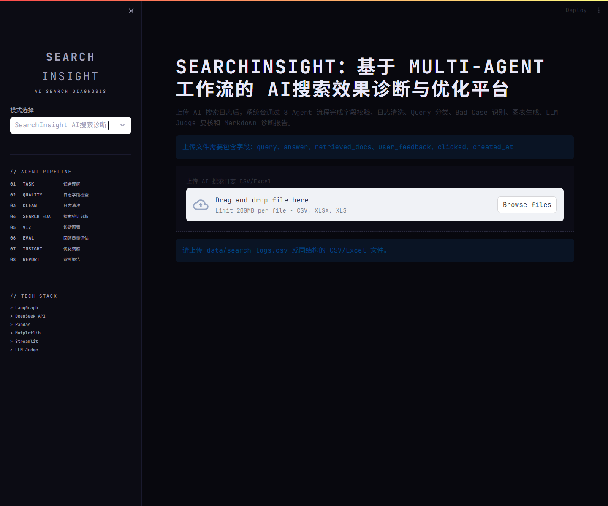
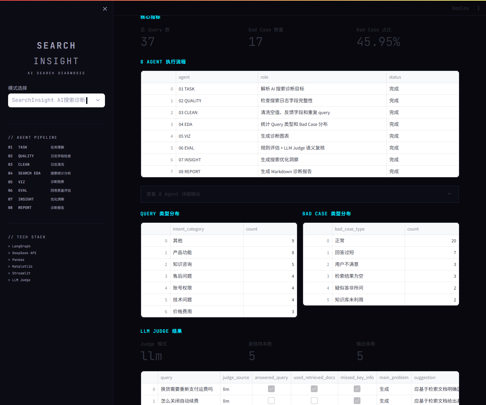
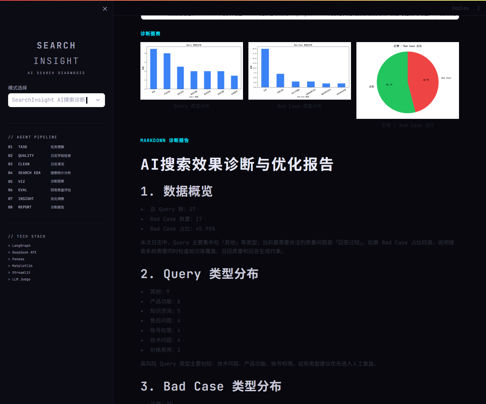
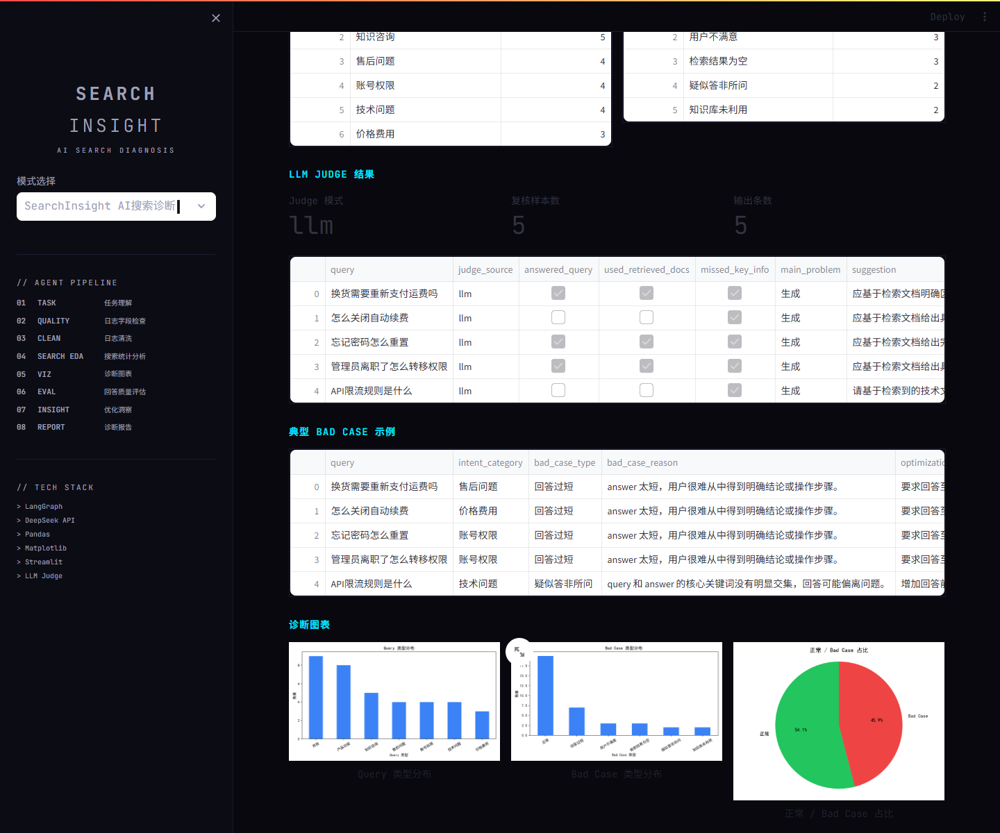
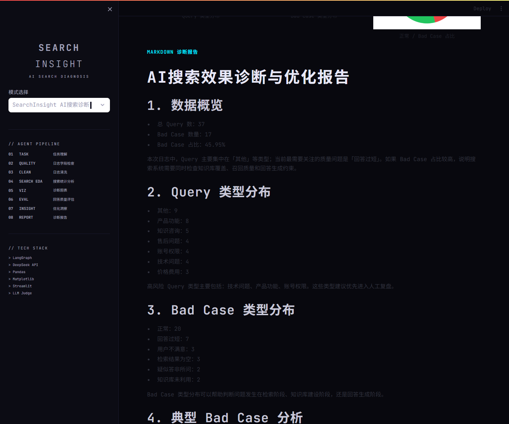

# SearchInsight：基于 Multi-Agent 工作流的 AI搜索效果诊断与优化平台

SearchInsight 是一个面向 AI 搜索 / RAG 问答系统的效果诊断平台。它可以分析用户 Query、AI 回答、知识库召回片段和用户反馈，识别 Bad Case，输出优化建议、可视化图表和 Markdown 诊断报告。

## 项目背景

很多 RAG / AI 搜索系统上线后，不只是要“能回答”，还要持续评估回答是否准确、完整、是否基于知识库，以及用户为什么不满意。SearchInsight 的目标是把这些搜索质量问题结构化，帮助团队定位问题出在检索、知识库、生成还是 Prompt 约束。

## 项目亮点

- 使用 8 个职责清晰的 Agent 工作流节点，覆盖日志检查、清洗、统计、评估、洞察和报告生成。
- 支持 Query 分类，区分售后问题、价格费用、账号权限、技术问题、产品功能、知识咨询等类型。
- 支持 Bad Case 识别，包括回答过短、检索为空、用户不满意、知识库未利用、疑似答非所问。
- 采用规则初筛 + LLM Judge 的方式，只对低质量样本做语义评估，避免每条日志都调用大模型。
- 支持知识库未利用分析，判断检索片段中有信息但回答没有体现的问题。
- 输出知识库补充建议、Prompt 优化建议和检索规则优化建议。
- 提供 Streamlit 可视化页面和 Markdown 诊断报告，适合演示和面试讲解。

## 业务流程


## 8 Agent 工作流说明

这里的 Agent 更像职责清晰的工作流节点，不强调每个节点都高度自主决策，而是强调稳定、可解释、可扩展。

| Agent | 职责 |
|---|---|
| TASK Agent | 搜索诊断任务理解 |
| QUALITY Agent | 日志字段检查 |
| CLEAN Agent | 搜索日志清洗 |
| EDA Agent | Query 与 Bad Case 统计分析 |
| VIZ Agent | 诊断图表生成 |
| EVAL Agent | 回答质量评估 / LLM Judge |
| INSIGHT Agent | 知识库、Prompt、检索优化洞察 |
| REPORT Agent | 诊断报告生成 |

## LLM Judge 说明

SearchInsight 不是把所有任务都交给大模型。字段检查、日志清洗、统计分析和图表生成都由代码完成；LLM Judge 只用于复杂语义判断，例如答非所问、知识库未利用、回答不完整等情况。

为了控制成本，系统只对规则筛出的低质量样本调用 LLM Judge。如果 API Key 缺失或调用失败，会自动 fallback 到规则评估结果，保证项目不会因为大模型不可用而崩溃。

## 技术栈

- Python
- Streamlit
- Pandas
- Matplotlib
- LangGraph
- LLM API / DeepSeek API
- Markdown Report

## 输入字段说明

上传 CSV / Excel 至少包含：

| 字段 | 说明 |
|---|---|
| query | 用户搜索问题 |
| answer | AI 生成回答 |
| retrieved_docs | 知识库召回片段 |
| user_feedback | 用户反馈，例如满意 / 不满意 |
| clicked | 是否点击 |
| created_at | 日志时间 |

## 运行方式

安装依赖：

```bash
pip install -r requirements.txt
```

生成示例数据：

```bash
python data/create_search_log_data.py
```

启动项目：

```bash
streamlit run app.py
```

## 页面预览

### 主界面


### Agent 工作流


### 诊断图表


### LLM Judge 结果


### 诊断报告


## 输出内容

项目会输出：

- Query 类型分布
- Bad Case 类型分布
- 高风险问题类型
- 典型 Bad Case
- LLM Judge 评估结果
- 知识库补充建议
- Prompt 优化建议
- Markdown 诊断报告

## 如何接入已有 AI 搜索 / RAG 系统

SearchInsight 不替代原有 RAG 问答链路，而是作为质量诊断层接在问答系统后面。原系统每次问答产生 `query`、`answer`、`retrieved_docs`、`user_feedback` 等日志后，可以定期导出为 CSV/Excel，交由 SearchInsight 分析 Bad Case 类型、知识库未利用问题和 Prompt 优化方向，从而辅助团队持续改进检索、知识库和回答生成效果。

## 项目结构

```text
SearchInsight/
├── app.py
├── requirements.txt
├── README.md
├── .gitignore
├── .env.example
├── data/
│   ├── create_search_log_data.py
│   └── search_logs.csv
├── engine/
├── workflow/
├── tools/
├── templates/
├── docs/
│   ├── assets/
│   ├── interview_notes.md
│   └── resume_project_description.md
└── outputs/
    └── .gitkeep
```

## 后续优化方向

- 增加 Prompt A/B 测试，用于比较不同回答策略的效果。
- 接入真实 RAG 日志，分析线上 query、召回片段和用户反馈。
- 接入 SQLite 保存历史诊断记录，方便对比多次优化效果。
- 增加人工标注闭环，让 Bad Case 判断可以和人工标签对齐。
- 优化 LLM Judge 评估指标，提升语义评估稳定性。
